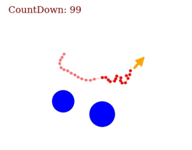
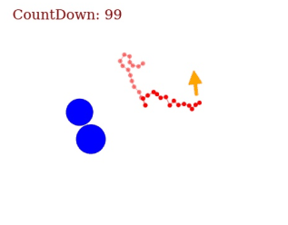
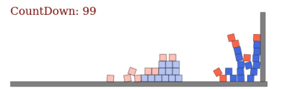
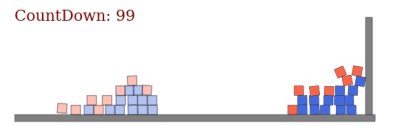

# Propagation Networks for Model-based Control Under Partial Observation

Yunzhu Li, Jiajun Wu, Jun-Yan Zhu, Joshua B. Tenenbaum, Antonio Torralba, Russ Tedrake

**ICRA 2019**
[[website]](http://propnet.csail.mit.edu/) [[paper]](https://arxiv.org/abs/1809.11169) [[video]](https://youtu.be/ZAxHXegkz48)

Demo
----

### Simulation

#### Newton's Cradle

Rollout from the learned model, where we show the ground truth in transparent. The discrpancy is almost not noticeable, which indicates that our model can successfully handle instantaneous propagation of forces.

### Control

#### Rope Manipulation
Shake a rope to match a target configuration shown in transparent, where we are only allowed to apply forces to the top 2 particles at the free end. Yellow arrow indicates the applied force.

 

#### Box Pushing
Push a pile of boxes to a target configuration shown in transparent. Note that we assume partial observability in this example where we are viewing the scene from the top and only red boxes are visible.

 

Installation
------------

This codebase is tested with Ubuntu 16.04 LTS, Python 3.6.8, PyTorch 1.0.0, and CUDA 9.0.

Play with the Physics Engines
-----------------------------

We provide three environments (1) Newton's Cradle, (2) Rope Manipulation, and (3) Box Pushing.

    python physics_engine.py --env Cradle
    python physics_engine.py --env Rope
    python physics_engine.py --env Box

The visualizations will be stored in `test/test_data_[env]`.

Evaluation
----------

You can direct run the following command to use the pretrained checkpoint. Note that the provided checkpoints perform slightly better than what have been reported in the original paper, as we have performed more intensive hyperparameter tuning.

    bash scripts/eval_Cradle.sh
    bash scripts/eval_Rope.sh
    bash scripts/eval_Box.sh

The resulting rollouts will be stored in `dump_[env]/eval_[env]_pstep_[pstep]_*/`, where ground truth is shown in transparent. Note that in env `Box`, this evaluation only shows the decoded results from the encoding space.

Model-Predictive Control
------------------------

You can direct run the following command to use the pretrained checkpoint.

    bash scripts/mpc_Box.sh
    bash scripts/mpc_Rope.sh

The controlling result will be stored in `dump_[env]/mpc_[env]_pstep_[pstep]_*/`, where the target configuration is shown in transparent. 

Training
--------

You can use the following command to train from scratch. **Note that if you are running script for the first time**, it will start by generating training and validation data. You will need to change `--gen_data` to `0` if the data has already been generated.

    bash scripts/train_Cradle.sh
    bash scripts/train_Rope.sh
    bash scripts/train_Box.sh

Citing PropNet
---------------

If you find this codebase useful in your research, please consider citing:

    @inproceedings{li2019propagation,
        Title={Propagation Networks for Model-Based Control Under Partial Observation},
        Author={Li, Yunzhu and Wu, Jiajun and Zhu, Jun-Yan and Tenenbaum, Joshua B and Torralba, Antonio and Tedrake, Russ},
        Booktitle = {ICRA},
        Year = {2019}
    }

